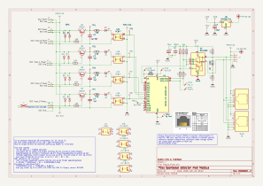
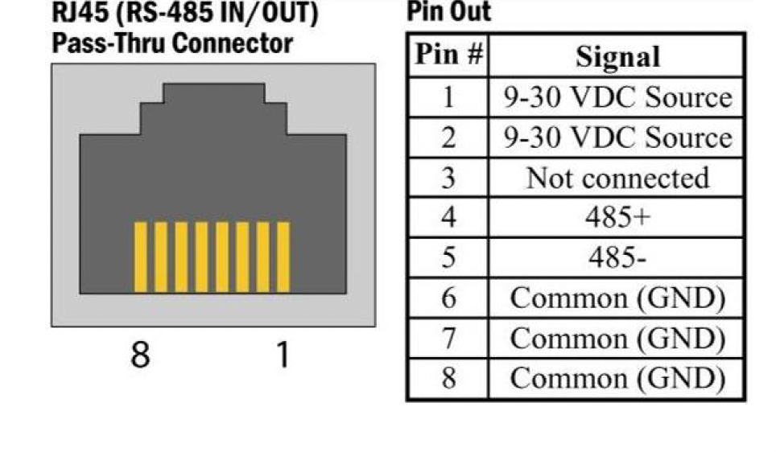

# Sporbesat med Modbus

## AI Help

* [AI Help ESPHome filters: - delayed_off](../Datasheet/AI_Help/AI_Help_ESPHome_filters_delayed_off.md)
  * [ESPHome Dokumentation](../Datasheet/AI_Help/AI_Help_ESPHome_filters_delayed_off.md#esphome-dokumentation)
  * [ESPHome how to set min time for input to be low before accepted](../Datasheet/AI_Help/AI_Help_ESPHome_filters_delayed_off.md#.md#esphome-how-to-set-min-time-for-input-to-be-low-before-accepted)
  * [can delayed_off bee set in milisec](../Datasheet/AI_Help/AI_Help_ESPHome_filters_delayed_off.md#can-delayed_off-bee-set-in-milisec)

## SporBesat a la´ Moppe

* 
* jeg blev inspireret til at lave en besat med
der af ovenstående diagram fra [moppe.dk/besat.html](https://moppe.dk/besat.html)
* herunder er min version so skal bruges sammen med Home Assistant & ESPHome:

## Sporbesat a la' SEKT

* 
* For a ting skal virke best muligt, er det en god ide at placerer dette modul tæt på sporisulstionen som muligt, og så forbinde kabel mellem U1 udgange til MCUen input.
* Lidt om diagrammet
  * D1 & D2 skal begrænse spændingen over Basis Emiter på Q1
    * Dioderne skal kunne børe en kortslutnings strøm, når der kommer kortslutning på skinderne, her 5A.
  * R2 på 10R skal begrænse strømen i Q1's Basis til under 5mA
  * U1 ved at bruge en Optokobler her, opnår vi adskillese mellem DCCs 19VAC og MCUs 3,3VDC.
    * U1's Collector forbindes til indgang på MCU eller MCU Interface
    * U1's Emiter forbindes til MCU GND
* MCU's Binary Sensor:
  * For at undgå falske sporbesat & sporfrit meldinger,  
  skal have forsinkelse for sporbesat på 50ms,  
  og en forsinkelse for sporfrit på 3sec.
  * Dette opnås med :

```yaml
YAML

  filters:
    - delayed_off: 50ms
```

og for spor frit:

```yaml
YAML

  filters:
    - delayed_on: 3sec
```

Se mere her [AI-Help_Input_min_Time.md](../Datasheet/AI_Help/AI_Help_ESPHome_filters_delayed_off.md)

## KiCad files

* Project files:
  * [Moppe.kicad_pro](./Moppe/Moppe.kicad_pro)
* Schematic files:
  * [Moppe.kicad_sch](./Moppe/Moppe.kicad_sch)

## Programming MCU i kredssløb

* If you share the same TX and RX pins for programming the ESP32-C3 and communicating with the MAX3485, they will interfere with each other.
* When you try to upload code, the MAX3485 will fight for control of the RX/TX lines, causing the programming to fail.
* To fix this, you have two choices:

### Solution 1: Use Series Resistors (Isolation Buffer)

* If you absolutely must use the exact same pins, you can add two 1kΩ resistors to give your programmer priority.
  * ESP32 TX (GPIO 21) → 1kΩ Resistor → MAX3485 DI
  * ESP32 RX (GPIO 20) → 1kΩ Resistor → MAX3485 RO
  * Your USB-to-UART Programmer connects directly to the ESP32 TX and RX pins (bypassing the resistors).
* How it works: The 1kΩ resistors limit the current from the MAX3485. When your USB programmer is plugged in, it easily overrides the MAX3485 signals, allowing you to flash code without unplugging anything.

### Solution 2: Move the MAX3485 to different pins (Recommended)

* The ESP32-C3 allows you to assign UART functions to almost any available GPIO pins in your code. The easiest solution is to leave the hardware programming pins alone and use different pins for the MAX3485.
  1. Keep your USB programmer dedicated to GPIO 20 (RX) and GPIO 21 (TX).
  2. Connect the MAX3485 to any other free GPIOs (for example, GPIO 4 for RX and GPIO 5 for TX).
  3.In your Arduino code, initialize a hardware serial instance on those pins like this:

```cpp

cpp

// Define your custom pins for MAX3485
#define RX_PIN 4
#define TX_PIN 5

void setup() {
  // Serial is for USB programming/debugging
  Serial.begin(115200); 
  
  // Serial1 is dedicated to your MAX3485
  Serial1.begin(9600, SERIAL_8N1, RX_PIN, TX_PIN); 
}
```

## Modbus med RJ45 Cat5e Kabel

* Kilde:
  * [How can the RJ-45 connections on RS-232 and RS-485 SeaI/O data acquisition devices be used?](https://www.sealevel.com/how-can-the-rj-45-connections-on-rs-232-and-rs-485-seai-o-data-acquisition-devices-be-used)
* Samtale i AI-tilstand: rs485 via rj45 connector
  * Using an RJ45 connector for RS-485 serial communication is an incredibly common industry practice used by manufacturers like Schneider Electric, Delta, and Cisco. It allows installers to leverage cheap, abundant, and pre-twisted Cat5e or Cat6 cabling rather than specialized serial wire.
  * However, there is no single universal standard pinout for RS-485 over RJ45. If you do not follow the specific pinout of your equipment's manufacturer, you risk damaging connected components.
  * Below is a breakdown of the two most common pinout standards, critical wiring requirements, and hardware implementations.

### 1. The Two Main Pinout Standards

* Because RS-485 is a differential signal, **the A (+) and B (-) signals must always be on the exact same twisted pair** to ensure proper noise cancellation.

#### **Standard A: The Modbus Organization Standard (TIA-856)**

* This is the official recommended standard by the Modbus Organization for serial Modbus over an RJ45 connector.

|RJ45 Pin|T568B Wire Color|RS-485 Function|Notes|
|:---:|:---|:---|:---|
|Pin 4|🔵 Blue|D1 / A / +|Non-inverting data signal (Twisted Pair 1)|
|Pin 5|🔵⚪ Blue/White|D0 / B / -|Inverting data signal (Twisted Pair 1)|
|Pin 8|🟤 Brown|Common / GND|Reference ground line (Crucial for isolation)|

#### Standard B: Alternative Industrial Pinout (e.g., Delta VFDs / Security Systems)

* Many automated hardware manufacturers swap the pairs to utilize the outermost positions or alternate twisted pairs.

RJ45 PinT568B Wire ColorRS-485 FunctionNotes

|RJ45 Pin|T568B Wire Color|RS-485 Function|Notes|
|:---:|:---|:---|:---|
|Pin 1|🟠⚪ Orange/White|D1 / A / +|Non-inverting data signal (Twisted Pair 2)|
|Pin 2|🟠 Orange|D0 / B / -|Inverting data signal (Twisted Pair 2)|
|Pin 7|🟤⚪ Brown/White|Common / GND|Reference ground line



## 2. Critical Wiring Rules

* **Never Plug RS-485 into an Ethernet Port:** While the connector is physically identical, injecting RS-485 voltages (up to 12V) into a standard 2.5V network switch or computer NIC will instantly burn out the magnetic transformers.
* **Always Connect the Ground (GND):** A common ***misconception*** is that RS-485 only requires two wires. Without a common ground reference between transceivers, standard-mode voltage spikes can cause data corruption or blow out communication chips.
* **Daisy-Chaining:** Standard Ethernet splitters cannot be used to break out the signal because they create "stubs" (T-junctions) that reflect signals. You must use a true daisy-chain block where the bus enters the adapter and immediately continues out to the next node
* **Termination:** Just like standard terminal-block RS-485, if your RJ45 cable run is long or operating at high speeds (above 9600 baud), you must bridge a 120-ohm resistor across the data pair (Pins 4 and 5, or 1 and 2) at the final physical device on the line.