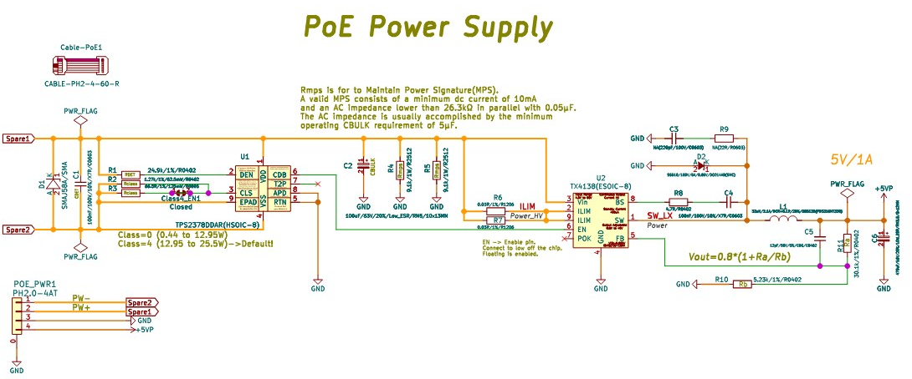

# Ethernet PoE interface with w5500

## AI Help

### W5500

* [ESPHome how do ethernet get mac address?](./AI_Help_w5500.md#esphome-how-do-ethernet-get-mac-address)
* [Do i have to enable wifi to get esp32 mac address?](./AI_Help_w5500.md#do-i-have-to-enable-wifi-to-get-esp32-mac-address)
* [Here is how ESPHome handles it and how you can find it:](./AI_Help_w5500.md#here-is-how-esphome-handles-it-and-how-you-can-find-it)
* [How do i connect w5500 to esp32-s3](./AI_Help_w5500.md#how-do-i-connect-w5500-to-esp32-s3)
* [How do i connect ip101 to esp32-s3](./AI_Help_w5500.md#how-do-i-connect-ip101-to-esp32-s3)
* [What to do next?](./AI_Help_w5500.md#what-to-do-next)
* [Create schematic of w5500](./AI_Help_w5500.md#create-schematic-of-w5500)

### PoE Power

* [is a poe switch power output dependency on lan connection](./AI_Help_PoE_Power.md#is-a-poe-switch-power-output-dependency-on-lan-connection)
* [How PoE and LAN Coexist](./AI_Help_PoE_Power.md#how-poe-and-lan-coexist)
* [Factors That Actually Affect PoE Power Output](./AI_Help_PoE_Power.md#factors-that-actually-affect-poe-power-output)
* [can I draw power without datalink](./AI_Help_PoE_Power.md#can-i-draw-power-without-datalink)
* [1. Active PoE (Standard: 802.3af/at/bt)](./AI_Help_PoE_Power.md#1-active-poe-standard-8023afatbt)
* [2. Passive PoE (Always On)](./AI_Help_PoE_Power.md#2-passive-poe-always-on)

## Ethernet Parts

* Phy:
  * [LPJ4112CNL, LPJ4112GENL with PoE](https://www.link-pp.com/products/3438.html#c_static_001_P_37851-1706231904227)
* W5500
  * [WIZnet W5500 ref-schematic](https://docs.wiznet.io/Product/Chip/Ethernet/W5500/ref-schematic)
  * [W5500 Ref.Schematic - RJ45 with Transformer](https://docs.wiznet.io/assets/images/w5500_sch_v110_use_mag_-19e2939c3f018e5d72f1b957f990f96d.png)
  

## PoE Parts

* [Step-Down Converter tx4138](https://jlc-prod-smt.oss-eu-central-1.aliyuncs.com/smtDataManualFile/8588883609847533568-C329267.pdf?response-content-disposition=attachment%3B%20filename%3DC329267.pdf%3B%20filename%2A%3DUTF-8%27%27C329267.pdf&x-oss-date=20260916T181025Z&x-oss-expires=1800&x-oss-security-token=CAISgAN1q6Ft5B2yfSjIr5vNet78obZV8qWocknyk24MSbxWlbLCmjz2IHhMdHJsAOodtv0%2FmmhT6PkclqRLcbhpcmfjV%2BZHzLB8qYEmqDwj557b16cNrbH4M4H6aXeirtuwDsz9SNTCALjPD3nPii50x5bjaDymRCbLGJaViJlhHLN1Ow6jdmhpCctxLAlvo9NgFxm3D%2Fu2NQPwiWf9FVdhvhEG6Vly8qOi2MaRmFy8yFTx0b0SvJ%2BjYMrmPctoN9JnSdC5mfdzau3a1TJ84gRD0a5wkaVA1zbDs5bfISEIuUzebreLqY03dV4mOvdqIcMe8qigz88fk%2FfIioH6xyxKOexoSCnFTOiiupCcQLPyao9jLu6iayqViY7QaIOTqQohZmkAMwVOasAsI3Ngh4zF97Qt0cVNkXO9gWfLI8DtuMleWoqoUvAtu6HD0eS19jklBdzSlusJRAJJUVBflCeKEaRNSAd3WGhEfM2%2BBt4QT30w5N2u00S8OSMIPaNggaKWD5sagAEZoX07W8mUpEzdq%2BfYtyiea43pivfC9EwdRz3wxDd0QSiAn5N%2FoQGXiHVoQiJKbAfuncGED1Lv2KEOyd3ivQWCqyQ3zh0rE%2BEF8jCOsnwH35NLJ%2FPInIzfUCv19Y%2B%2BJvFk4awWJpXpPeVrDBdbgWvsphRg7t9Kf5bz8qINYJveMCAA&x-oss-signature-version=OSS4-HMAC-SHA256&x-oss-credential=STS.NXx1dHLitEgCpoCwnYE3zzwix%2F20260916%2Feu-central-1%2Foss%2Faliyun_v4_request&x-oss-signature=2de573735e5750972c52d28762c2504ed2ade677821bae38c5c3b9e674b3721e)

|||
|:---:|:---:|
|||

