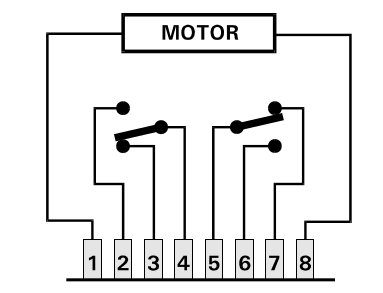
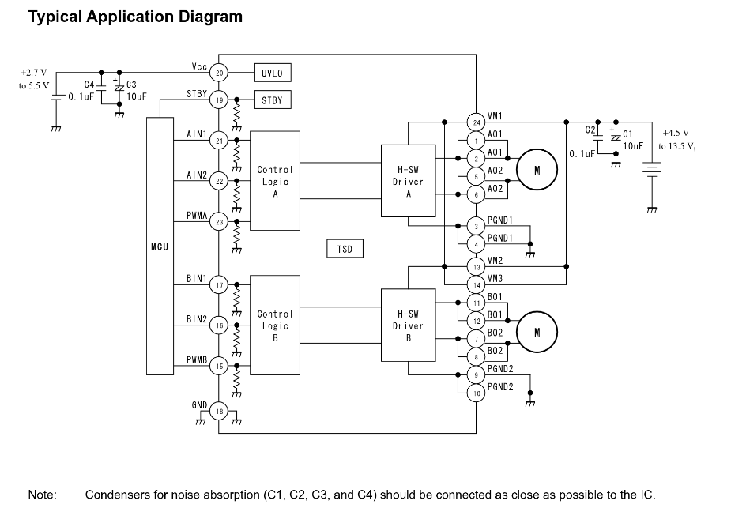
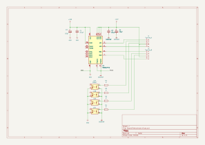

# Sporskiftecontroler

## Datasheet

* [TB6612FNG.pdf](../Datasheet/TB6612FNG.pdf)
* [ULN2803.pdf](../Datasheet/ULN2803.pdf)
* [MT3608-3223743.pdf](../Datasheet/MT3608-3223743.pdf)
* 15EDG 2.54 mm KF2EDG PCB Screw Terminal Block Connector
* [Waveshare ESP32-S3-POE-ETH](https://www.waveshare.com/product/esp32-related/boards-kits/esp32-s3/esp32-s3-eth.htm?___SID=U)

### TORTOISE & TB6612FNG

|TORTOISE_Switch|TB6612FNG_Typical_App_Diagram|
|:---:|:---:|
|||

## KiCad

* 
* KiCad Files:
  * [Sporskiftekontroler.kicad_pro](./Sporskiftekontroler/Sporskiftekontroler.kicad_pro)
  * [Sporskiftekontroler.kicad_sch](./Sporskiftekontroler/Sporskiftekontroler.kicad_sch)
